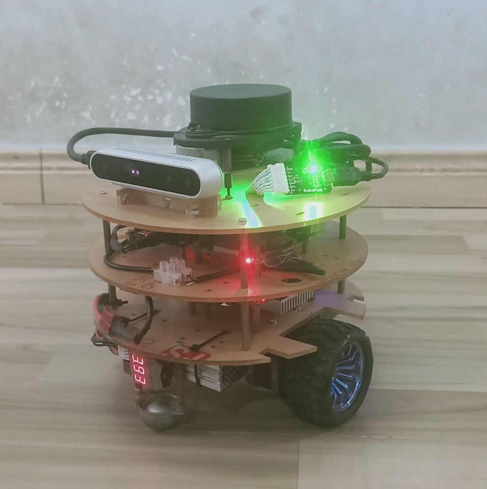

# PIFBot

  

### 1. Overview 

PIFBot is a ROS-based mobile robot for running SLAM (Simultaneous Localization and Mapping) algorithms to build a map and driving around this map. This robot is primarily equiped LiDAR, RGB-D camera and odometer sensors that makes it compatible with many SLAM methods. The PIFBot can be customized in various ways depending on how you reconstruct mechanical parts and use optional parts such as sensors and the computer to meet many different purposes. 

### 2. Requirement

#### 2.1. Ubuntu 16.04 Xenial

Ubuntu has been the primary platform for ROS. The releases is available to download from [Ubuntu home page.](https://ubuntu.com/)

#### 2.2. ROS Kinetic

This project uses ROS Kinetic that compatible with Ubuntu 16.04 (Xenial) to have better support from ROS community. Follow this [link](http://wiki.ros.org/kinetic) to see the installation instructions. 

#### 2.3. STM-IDF (STM32 Integrated Developement Framework)

[STM-IDF](https://github.com/thanhphong98/stm-idf) is an open source framework for STM32 that using C/C++ programming languague. The majority of the components in STM-IDF are available in [Github](https://github.com/thanhphong98) under the MIT license. 

