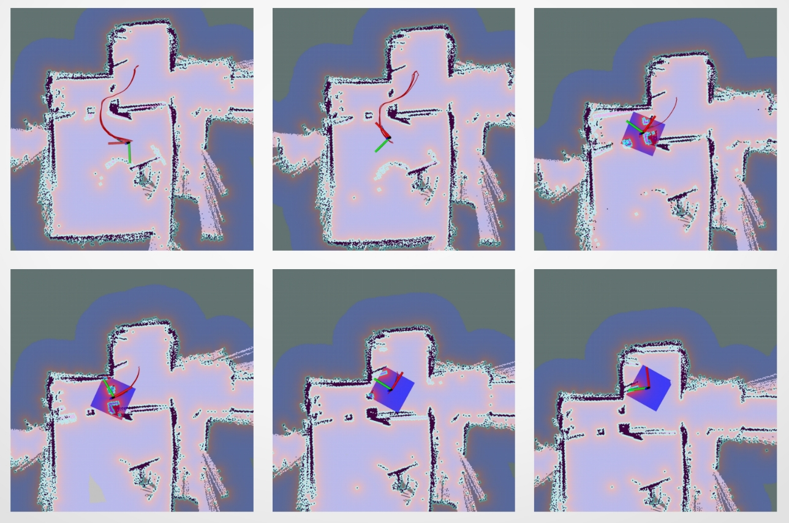

# PIFBot
  
### 1. Overview 

PIFBot is a ROS-based mobile robot for running SLAM (Simultaneous Localization and Mapping) algorithms to build a map and driving around this map. This robot is primarily equiped LiDAR, RGB-D camera and odometer sensors that makes it compatible with many SLAM methods. The PIFBot can be customized in various ways depending on how you reconstruct mechanical parts and use optional parts such as sensors and the computer to meet many different purposes. 

### 2. Requirement

#### 2.1. Ubuntu 16.04 Xenial
Ubuntu has been the primary platform for ROS. The releases is available to download from [Ubuntu home page.](https://ubuntu.com/)

#### 2.2. ROS Kinetic
This project uses ROS Kinetic that compatible with Ubuntu 16.04 (Xenial) to have better support from ROS community. Follow this [link](http://wiki.ros.org/kinetic) to see the installation instructions. 

#### 2.3. STM-IDF (STM32 Integrated Developement Framework)
[STM-IDF](https://github.com/thanhphong98/stm-idf) is an open source framework for STM32 that using C/C++ programming languague. The majority of the components in STM-IDF are available in [Github Repository](https://github.com/thanhphong98) under the MIT license. 

### 3. Mobile base control

Main controller board for PIFBot is OpenSTM32. The OpenSTM32 board is developed for ROS embedded systems to provide completely open source hardware and software. Everything about the board; Schematic, PCB Gerber, BOM and the firmware source code for PIFBot are available in [Github Repository](https://github.com/thanhphong98/openSTM32F4_LQFP64) and free to distribute under MIT license. 

The STM32F4 series is a main chip inside the OpenSTM32 board which is based on a very powerful ARM Cortex-M4 with Floating Point Unit (FPU). The developement environment for OpenSTM32 is wide open but STM-IDF which mentioned above is selected as main programming tool. 

OpenSTM32 provides digital and analog input/output pins that can interface with extension board or various sensors. 9-DOF IMU MPU9250 is available to make this board capable of processing complex motion fusion algorithms. OpenSTM32 features various communication interfaces: SPI, I2C, UART, I2S for other embedded devices. 

OpenSTM32 will be the best solution for implementing your embedded control design.

#### 3.1. Schematic

#### 3.2. openSTM32 Board
 

### 4. Hardware assembly

Differential drive which is the most common mobile robot model is applied to PIFBot. The shape of the robot is selected as circle with two driving wheels and two caster wheels. Design in this way make the robot easy to move according to control commands. 

This table shows many important size specifications of PIFBot. 

| Specification    | Dimension |
|------------------|-----------|
| Chassis diameter | 200 mm    |
| Maximum height   | 212 mm    |
| Wheel diameter   | 65 mm     |
| Axle distance    | 165 mm    |

#### 4.1. Chassis
PIFBot's chassis is made of mica. The chassis is designed in the way so that make it easy to carry optional parts as well as sensors. DXF files is available in this repository for laser cutting or CNC.

#### 4.2. Motor control and wheels
TB6560 stepper motor driver is used for controlling 42x42 mm stepper motor which working as actuator element. The PIFBot consists of two 65mm diameter fixed powered wheels mounted on the left and right side of the robot platform. Two castor wheels is used for balance and stability. 

#### 4.3. Single Board Computer
The Single Board Computer (SBC) is required to be able to install Linux ROS that provides the ability to use PIFBot's feature. There are various type of SBC, but Raspberry Pi 3 B+ is selected as main computer for PIFBot. 

#### 4.4. Controller Board
Calculating odometry data and controlling robot's motion are the essential requirements of controller board. The OpenSTM32 is designed to meet this requirements. There are also many available connectors in this board that make it suitable for various sensors or other applications. 

#### 4.5. Sensors
**RPLIDAR A1**  
360 Laser Range Finding RPLIDAR A1 is a 2D laser scanner capable of sensing 360 degrees that collects a set of data around the robot to use for SLAM (Simultaneous Localization and Mapping) and Navigation. It supportsnUSB interface and is easy to install on a PC. 

**Intel RealSense D415**  
The Intel RealSense D415 camera is a USB 3.0 device that can provide color, depth and infrared video streams. PIFBot adopts this camera to enable 3D SLAM and Navigation, and it is possible to apply various applications such as gesture recognition, object recognition and scene recognition based on 3D depth information obtained using RealSense Tecnology. 

#### 4.6. Power supply
OpenSTM32 controller board has both a 5V power and a 12V power, which are used in Raspberry Pi. DC/DC Buck Converter LM2596 is used for taking 11.1V from 3 cell lipo baterry and converting it into 5V that can power controller board and SBC.

### 5. System design

The system is seperated into two parts: ROS and base control. SBC receives data that collected from RPLIDAR A1 and Intel RealSense D415 camera to publish to ROS's topics. ROS's topics are owned by ROS Master so PC also implement publisher and subscriber to topics which contains data published from SBC. PC runs SLAM algorithms and Navigation, then publish motion commands to topic that manages robot's velocity (both angular and linear velocity). The motion command will be sent to controller board over rosserial protocol so that robot can build the map and drive around in this map. Simultaneously, controller board calculates robot's odometry data and feeds backward to ROS Server.

### 6. Result
Real-Time Appearance-Based Mapping is used for practing SLAM and Navigation. 

#### 6.1. SLAM

#### 6.2. Navigation

#### 6.3. Loop-closed detection

#### 6.4. Multi-session SLAM 

#### 6.5 Video
Follow [this link](https://youtu.be/UWhPCQyU918) to watch video on Youtube. 

#### 7. Problem
For any problems, please report to [Issues](https://github.com/thanhphong98/PIFBot/issues) or contact email thanhphongho1998@gmail.com
